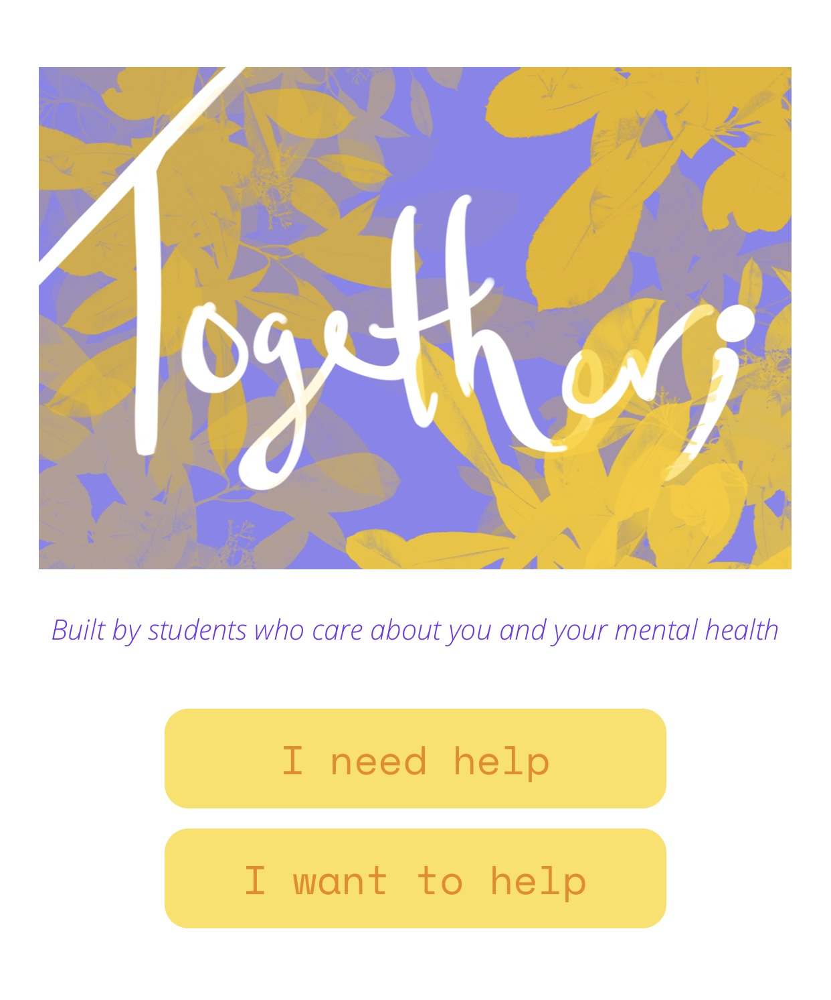

<h1 align="center">
    Together;
</h1>

<p align="center">
  <strong>WHY?</strong><br>
  Create a safe space and community 
  to erase stigmas surrounding mental health.
</p>




## Contents

- [Introduction](#introduction)
- [Installation](#installation)
- [Useage](#useage)
- [Troubleshooting](#troubleshooting)
- [Contribution](#contribution)
- [License](#license)

## Introduction
Together is an in development iOS application that allows people to connect and find
valuable resources surrounding mental health awareness. This application allows for forum discussions.

This application was developed by Appalachian State University students for Chapel Hill's 2020 Pearl Hacks in hope of making
a positive change for our communities. 

## Installation
<strong> Requirements: </strong><br>
<ul>
<li>Unix / Linux machine</li>
<li>Terminal</li>
<li>  
  <a href="https://reactnative.dev/">
    React Native
  </a> </li>
</ul>

<strong> Optional: </strong><br>
<ul>
<li> Expo Phone Application </li>
</ul>

Running iOS applications is limited to macOS. The Expo application can be used to emulate 
Together; via smart phone.

<strong> Follow these steps: </strong><br>
```
clone https://github.com/lycb/Together
cd Together
npm install -g expo-cli
```

## Useage

<strong> To run use the command: </strong><br>
```
nmp start
```
Make sure you are in the Together directory.

This will open a web browswer with a Local Hoast connection.


If you have the phone application, scan the QR code from the terminal.
<ul>
<li>If on Android, scan via Expo application</li>
<li>If on iOS, scan via Camera application</li>
</ul>

If you do not have the application, simply follow the Expo DevTool link through the terminal.
*This is the same page as the Local Hoast connection.*


 
Choose <strong> Run in web browser </strong><br>
This will open a new tab within the web browser that emulates the iOS application. 

## Troubleshooting
<strong>  <ul>
<li>Create an Issue</li>
<li>Be specific about the issue you need help with</li>
</ul></strong><br>

<strong>If you are having connection issues with the Expo smart phone application, on the DevTool browser try changing Lan to Tunnel</strong><br>

## Contribution
<ul>
<li>Fork</li>
<li>Create desired additions</li>
<li>Make a pull request</li>
</ul>

## License
<!-- link below -->
[MIT License](https://github.com/gabiiiiiii/Together/blob/master/LICENSE) 
